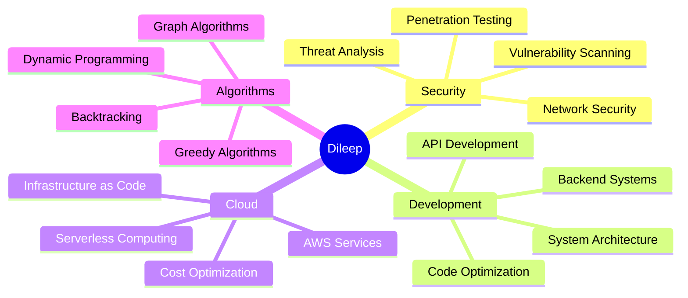

# 👨‍💻 Dileep Kumar Reddy Yellampalli

<div align="center">
  


</div>


## 🌟 About Me


```python
class CyberSecurityExpert:
    def __init__(self):
        self.name = "Dileep Kumar Reddy Yellampalli"
        self.role = "Cybersecurity Enthusiast & Developer"
        self.location = "Vijayawada, Andhra Pradesh, India"
        self.languages = ["Python", "Java", "C"]
        self.cloud_expertise = ["AWS EC2", "S3", "IAM", "Lambda"]
        self.security_focus = ["Network Security", "Vulnerability Scanning", "Penetration Testing"]
        self.passion = "Building secure systems & exploring cutting-edge tech"
        
    def get_current_focus(self):
        return ["Cloud Security", "Algorithm Optimization", "System Architecture"]
        
    def say_hello(self):
        print("Thanks for visiting my profile! Let's build something secure together! 🔐")

me = CyberSecurityExpert()
me.say_hello()
```

## 🛠️ Tech Arsenal

<div align="center">

### 💻 Programming Languages


### ☁️ Cloud & DevOps


### 🔐 Security & Tools


</div>

## 🚀 Featured Projects

<div align="center">

| 🔐 **Security Dashboard** | 📊 **AWS Automation** | 🧠 **DSA Mastery** |
|:-------------------------:|:----------------------:|:-------------------:|
|  |  |  |
| Real-time threat tracking using Python & APIs | Automated deployment with Boto3 & cost monitoring | 300+ LeetCode problems solved |
| `Python` `APIs` `Dashboard` | `AWS` `Boto3` `Automation` | `DSA` `DP` `Graphs` |

</div>

## 📊 GitHub Analytics

<div align="center">
  


</div>

<div align="center">
  
[](https://git.io/streak-stats)

</div>

## 🏆 Achievement Stats

<div align="center">

| 🎯 **Metric** | 📈 **Achievement** |
|:-------------:|:------------------:|
| 🧠 **LeetCode Problems** | 300+ Solved |
| ☁️ **AWS Services** | 5+ Mastered |
| 🔐 **Security Tools** | 10+ Proficient |
| 💻 **Languages** | 3 Primary |
| 🏅 **Projects** | 15+ Completed |

</div>

## 💡 Expertise Areas

<div align="center">



</div>

## 🌐 Connect With Me

<div align="center">

[](mailto:dileepreddy1304@gmail.com)
[](https://linkedin.com/in/dileep-kumar-reddy-y-82a825314)
[](https://github.com/dileepkumarreddy13)

</div>

---

<div align="center">

### 🔐 Security Quote of the Day
*"The best way to secure a system is to understand how it can be broken."*


### 💫 *"Building tomorrow's secure systems today"* 💫

</div>

---

<div align="center">
  
**⭐ Star my repositories if you find them interesting!**
  
</div>
